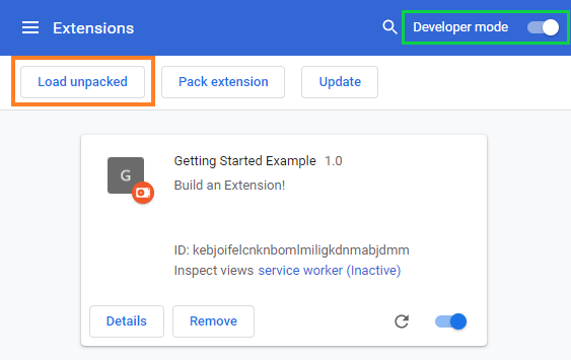

# Wordle Answer Extension

Never lose your streak on Wordle again.

## Install

Google Chrome / Brave / Microsoft Edge
[Chromium Based Browsers](<https://en.wikipedia.org/wiki/Chromium_(web_browser)#Browsers_based_on_Chromium>)

1. [Download the latest build](https://github.com/ultirequiem/wordle-answers-extension/releases/latest/download/wordle-answers.zip)

2. Unzip the directory, you should have a `wordle-answers` directory now

3. Open the Extension Management page by navigating to `chrome://extensions`

4. Enable Developer Mode by clicking the toggle switch next to Developer mode

5. Click the Load unpacked button and select the extension directory

## License

Released under the MIT License.
